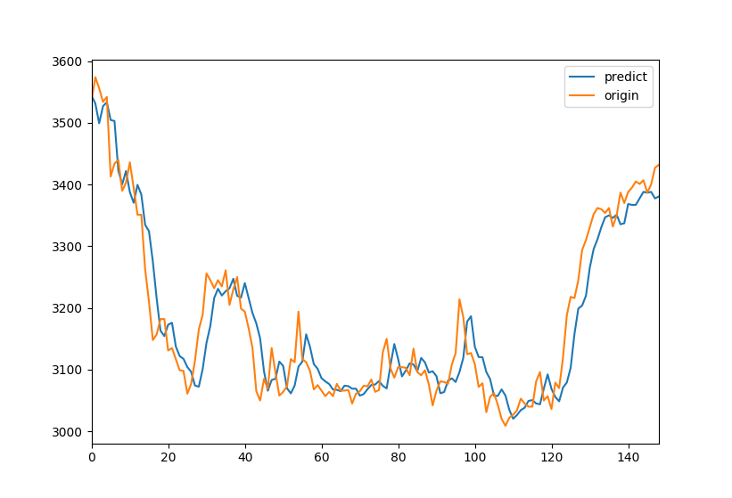
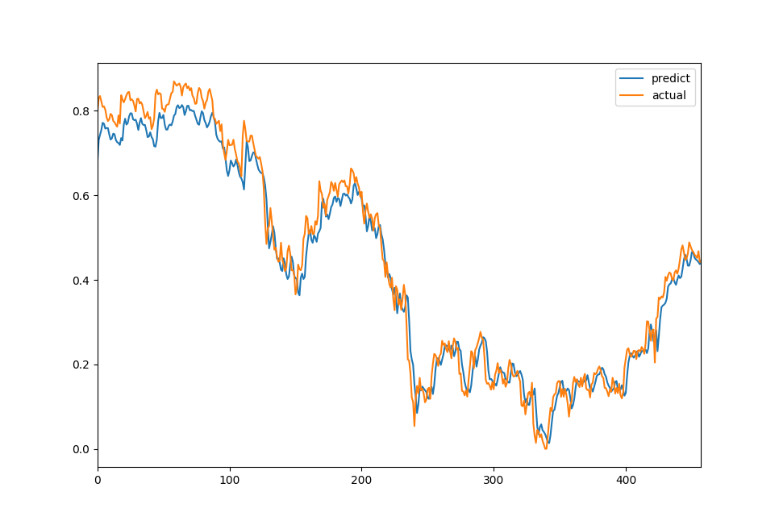

# Keras LSTMで株価予想をしてみた

# 概要
tensorflow(Keras)を使用して、n日間の傾向を元に次の日の傾向と終値の予想を出します。   
精度はかなりイマイチというか全く実用レベルにないです。   
Kerasの勉強用に作ったので、コード参考にされる際はご注意を。   
(アドバイスあればもらえるとうれしいです)   

# 構成
```
.
├── README.md
├── data
│   ├── *.csv   # 学習対象とするcsvデータ
├── loaddata.py # dataディレクトリにあるcsvデータを読んで
                # LSTMのmodelデータを生成します
├── model
│   └── keras-models.h5
├── predict_actual_compare.py # 特定のファイルの実値と予測値を比較します
├── predict_data
│   └── 7267-2017.csv         # 予測対象のデータ
├── predict_perform.png
├── predict_perform.py        # 明日の終値を予測します
└── requirements.txt          # パッケージ依存
```


# Reqirements
Python3以上   
パッケージ類は[requirements.txt](requirements.txt)を参照して下さい。

# Setup
```Python
pip install -r requirements.txt
```
# 実行結果

## predict_perform

```shell
$ python3 predict_perform.py
予想では前日より [ 23.40478516] 円 上昇する傾向です。
前日の終値実値:  [3432.0]
今日の終値予想:  [ 3404.01293945]
```

## predict_actual_compare

